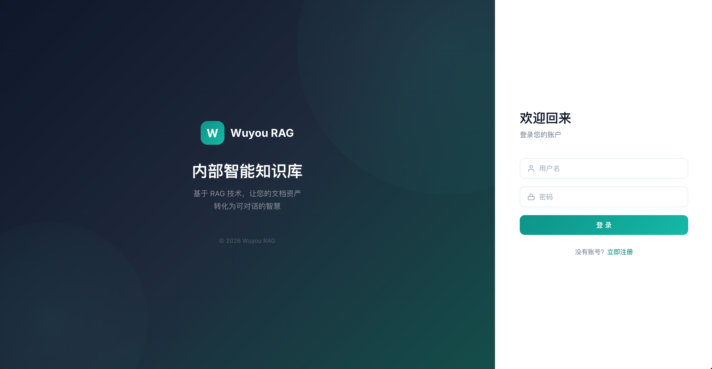

# 无忧 RAG — 内部智能知识库

基于 **RAG（检索增强生成）** 的企业内部 AI 知识服务平台，整合文档、接口规范、运维手册等数据，通过语义检索 + 大模型实现精准问答。

## demo


## 技术栈

| 层级 | 技术 |
|------|------|
| 后端 | Spring Boot 3.2 + Java 17 |
| 前端 | Vue 3 + Vite + Element Plus |
| 数据库 | MySQL 8.0 |
| 缓存 | Redis 7 |
| 消息队列 | RabbitMQ 3.8 |
| 向量库 | Milvus 2.4 |
| 对象存储 | MinIO |
| Embedding | BGE-large-zh-v1.5 (FastAPI 独立部署) |
| LLM | 通义千问 / 兼容 OpenAI 接口的模型 |

## 项目结构

```
wuyou-rag/
├── rag-bootstrap/      # 主应用入口（启动类 + 配置 + DB schema）
├── rag-controller/     # REST API + Spring Security + JWT
├── rag-service/        # 业务逻辑、RAG 流水线、外部集成
├── rag-dao/            # MyBatis-Plus Mapper + Entity
├── rag-common/         # Result<T>、BizException、ErrorCode
├── rag-frontend/       # Vue 3 前端
├── app.py              # Embedding 服务（BGE 模型）
├── docker-compose.yml  # 本地基础服务编排
└── docs/               # 设计文档
```

## 快速开始

### 1. 启动基础服务

```bash
docker compose up -d mysql redis rabbitmq minio etcd milvus
```

### 2. 启动 Embedding 服务

```bash
pip3 config set global.index-url https://pypi.mirrors.ustc.edu.cn/simple
pip3 config set install.trusted-host pypi.mirrors.ustc.edu.cn
pip install sentence-transformers fastapi uvicorn

export HF_ENDPOINT=https://hf-mirror.com
uvicorn app:app --host 0.0.0.0 --port 5001
```

验证：

```bash
curl -X POST http://localhost:5001/embed \
  -H "Content-Type: application/json" \
  -d '{"texts": ["你好", "RAG是什么"]}'
```

### 3. 启动后端

```bash
cd rag-bootstrap
mvn spring-boot:run -Dspring-boot.run.profiles=dev
```

### 4. 启动前端

```bash
cd rag-frontend
npm install
npm run dev
```

## RAG 核心流程

### 文档入库（异步）

```
用户上传文件 → MinIO 存储 → RabbitMQ 消息
  → DocumentParser 解析（PDF/DOCX/MD）
  → TextChunker 分块
  → EmbeddingService 向量化（调用 BGE 服务）
  → VectorService 存入 Milvus
```

### 问答流程

```
用户提问
  → EmbeddingService 向量化问题
  → VectorService Milvus 相似度检索（TopK）
  → PromptBuilder 组装（system prompt + chunks + 历史 + 问题）
  → LlmService 调用 LLM
  → 返回答案 + 来源引用
```

### 关键配置（kb_config 表）

| key | 说明 |
|-----|------|
| `llm.api_url` | LLM 接口地址 |
| `llm.model_name` | 模型名称（如 qwen-plus） |
| `embedding.api_url` | Embedding 服务地址，默认 `http://localhost:5001/embed` |
| `embedding.model_name` | bge-large-zh-v1.5 |
| `chunk.max_size` | 分块大小（字符） |
| `chunk.overlap` | 分块重叠（字符） |
| `milvus.host` / `milvus.port` | Milvus 连接信息 |
| `search.top_k` | 检索返回数量 |

## API 概览

| 模块 | 路径 | 说明 |
|------|------|------|
| 认证 | `/api/v1/auth/**` | 登录/注册/登出 |
| 会话 | `/api/v1/chat/**` | 问答、历史、反馈 |
| 知识库 | `/api/v1/knowledge/**` | 知识库 CRUD |
| 文档 | `/api/v1/document/**` | 上传/解析/删除 |
| 管理 | `/api/v1/admin/**` | 用户管理、审计日志、系统配置 |

## Embedding 服务部署

详见 [EMBED_SERVICE.md](./EMBED_SERVICE.md)。

模型离线下载（可选）：

```bash
pip install -U huggingface_hub
huggingface-cli download BAAI/bge-large-zh-v1.5 --local-dir ./bge-large-zh-v1.5
```

## 高可用设计

- **LLM 调用治理**：Resilience4j 熔断 + 重试 + 限流
- **文档处理异步**：RabbitMQ 削峰 + 死信队列补偿
- **热点缓存**：Redis 缓存高频问答
- **安全审计**：权限分级、敏感词过滤、操作留痕、日志脱敏
